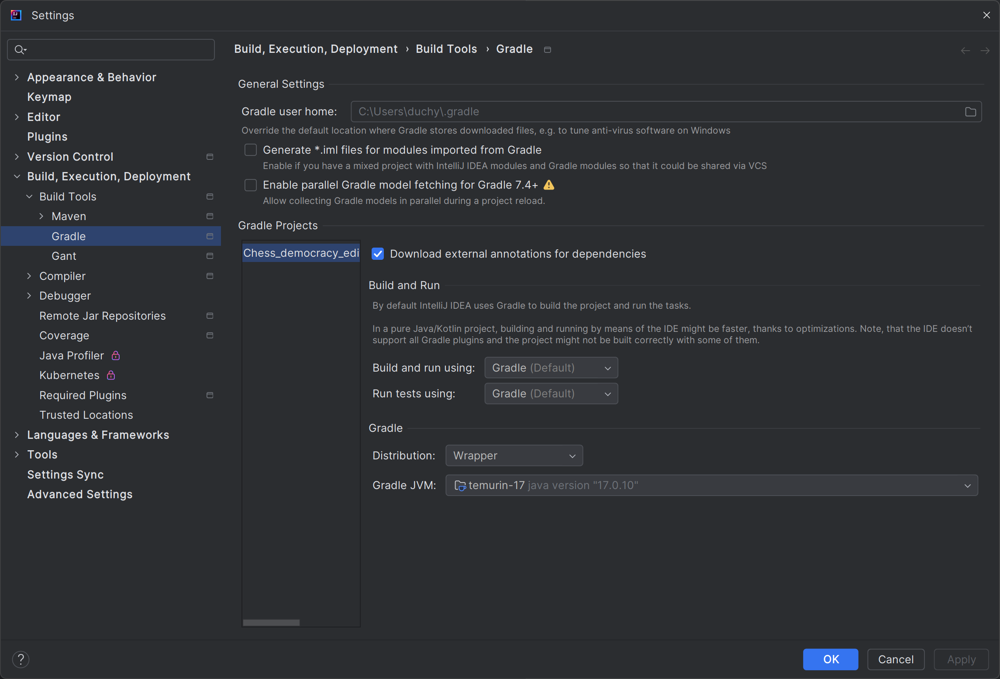
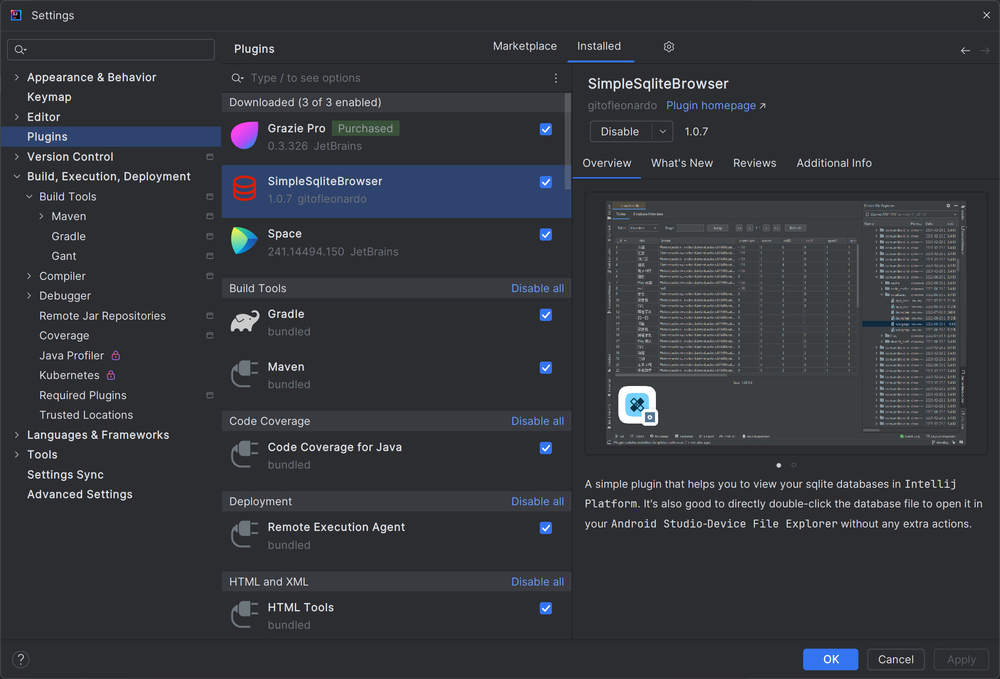
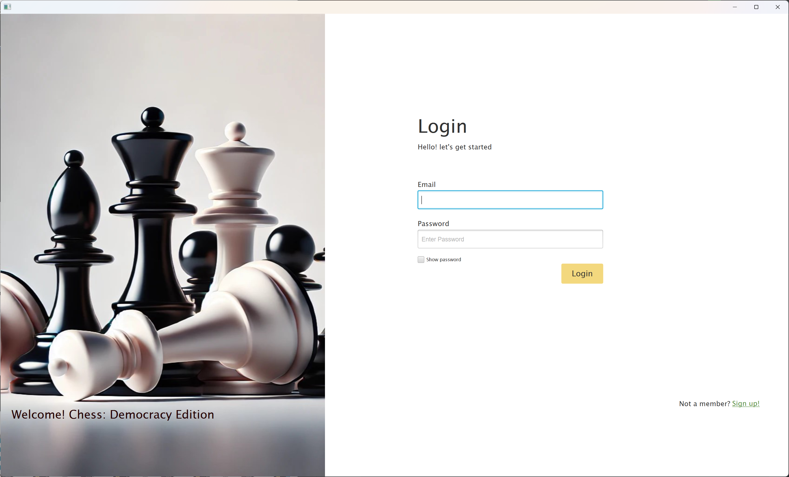
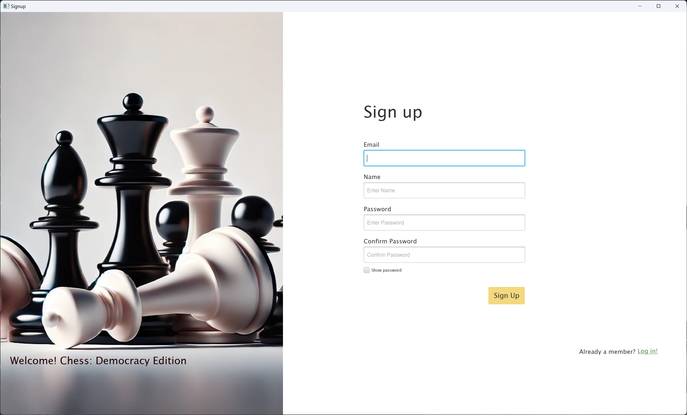
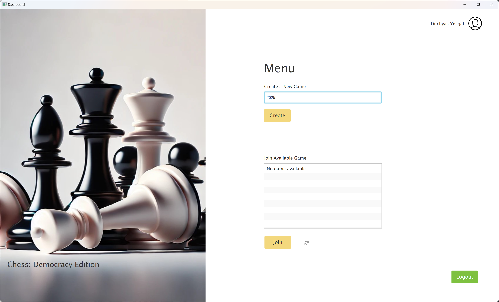
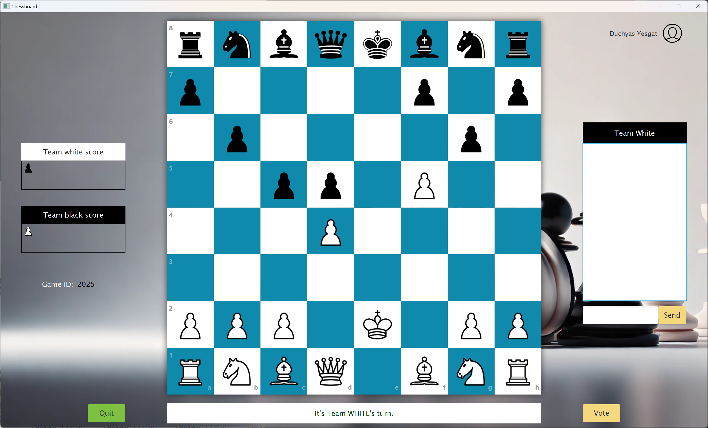
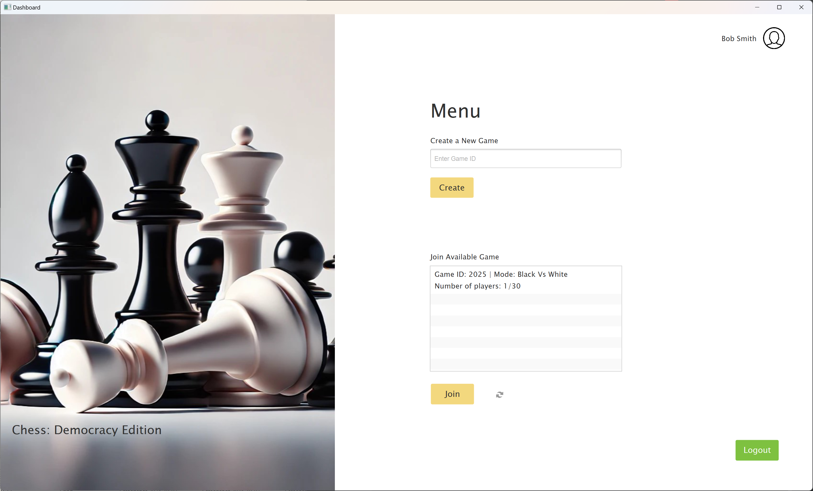
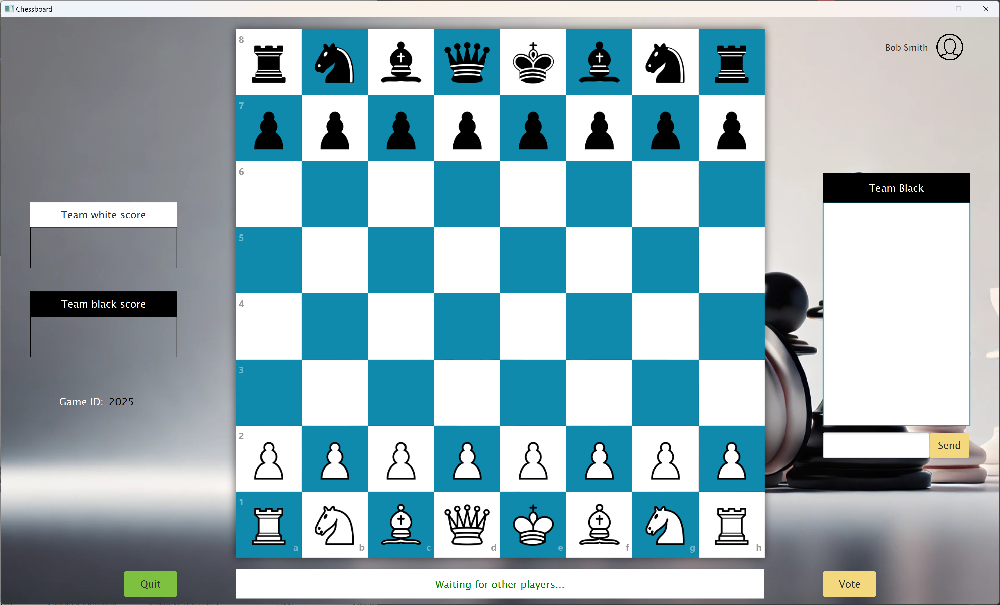

**Overview of Chess: Democracy Edition**

Chess: Democracy Edition is a multiplayer chess game that transforms traditional chess into a dynamic, team-based experience. Players are randomly divided into equal teams of white and black, with each player aware of their own team affiliation but not that of others. The game incorporates anonymous voting, where all players discuss potential moves and cast votes to determine the next move. In the case of a tie, only the votes from the team whose turn it is are counted. This gameplay introduces new levels of strategy, psychology, and engagement as players work to secure victory for their respective teams. The challenge of determining optimal moves is heightened by the influence of adversarial voting, where both teams attempt to influence the outcome, leading to rich strategic dynamics.

**How To Run The Application**

- Developed in IntelliJ IDEA Community Edition, this project is a Java application built with the Gradle wrapper. To run the application, open the project in IntelliJ IDEA. You'll need the Gradle wrapper plugin installed beforehand, as well as SimpleSqliteBrowser to test the database code, which can be found in the IntelliJ plugin marketplace under the settings and plugins. 

- The IntelliJ Gradle settings we used to develop this app are included below, along with a screenshot of SimpleSqliteBrowser:

**Running the Application:**

1. Open the project in IntelliJ IDEA and configure any necessary dependencies and settings.

2. Run the application by executing the main class "MainApplication." Once the application launches, the login screen will appear.

3. Create a new account:

   - Click the signup button in the bottom right corner of the app.
   - Enter the appropriate information and follow the prompts.
   - The app includes various error-handling mechanisms to prevent invalid information from being entered into the database, providing clear error messages for verification.

4. Log in:
   - After successfully creating your account, click the login button located in the bottom right corner of the signup screen.
   - Enter your login credentials.

5. Navigate the application:

   - Once logged in, use the dashboard buttons to create games, view existing games, or access other functionalities.

6. Close the game properly:

   - When you're ready to exit, click the quit button in the bottom left corner of the chessboard screen.

7. Test the game joining functionality:

   - Do not close the app; instead, launch the application again.
   - Log in using the second set of credentials to see a list of the first game created.
   
   
8. Test a second user:

   - Follow the signup and login instructions as before.
   - Once the second user is successfully logged in, they will be able to see the games that have already been created on the dashboard.

**Here's what you'll see:**

**Login Screen**

**Sign up Screen**

**Dashboard Screen**

**Chessboard Screen and game play**

**Dashboard Screen after a second user logging in to the game**

**Chessboard Screen after the second user joined the same game ID**

**The voting and communication feature are not implemented.**